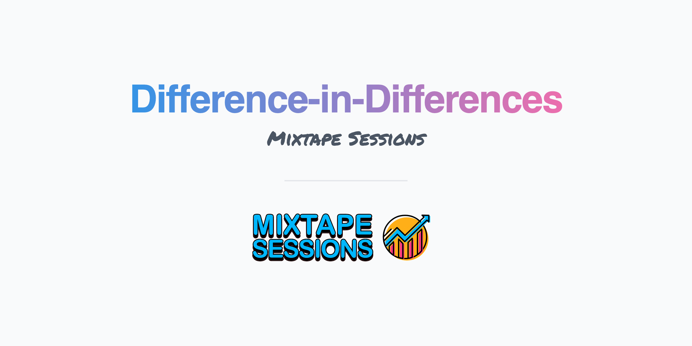

 
 

 

The most common quasi-experimental method in the quantitative social sciences is the difference-in-differences research design. This methodology has undergone substantial updates over the last few years as econometricians and statisticians have begun investigating the historical use of panel fixed effects estimators more closely as well as devising alternative models that perform best under heterogenous treatment effects and heterogenous policy adoption. This 1-day workshop will cover the most important new theoretical papers with an aim towards intuition and implementation. It will also include substantial group programming assignments.
 

&nbsp;

&nbsp;

  
 
 

<b>Introduction</b>
 

<b>About</b>

... 

<b>Slides</b>

... 

<b>Code</b>

... 

<b>Readings</b>

... 

 

<b></b>
 

<b>About</b>

... 

<b>Slides</b>

... 

<b>Code</b>

... 

<b>Readings</b>

... 

 

<b></b>
 

<b>About</b>

... 

<b>Slides</b>

... 

<b>Code</b>

... 

<b>Readings</b>

... 

 

<b></b>
 

<b>About</b>

... 

<b>Slides</b>

... 

<b>Code</b>

... 

<b>Readings</b>

... 

 

<b></b>
 

<b>About</b>

... 

<b>Slides</b>

... 

<b>Code</b>

... 

<b>Readings</b>

...

 
